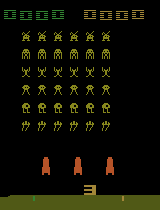
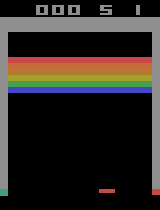

# DecoderFreeMiniDreamer
A decoder free version of my previous dreamer agent that uses a barlow twins self-supervised learning objective instead of a reconstruction loss.

 

Model based reinforcement learning can be vastly more sample efficient than model free reinforcement learning. If we learn a model of the environment then we can do rollouts of the world model and train an agent in the world models "imagination". The recent success of DreamerV4 got me interested in this area of reinforcement learning research and inspired me to take on this project.

## Components
This project uses a discrete recurrent state-space model(RSSM) with a convolutional visual encoder used for the world model, a barlow twins-style self-supervised learning objective for the world model latents, and an actor-critic agent trained in imagination just like in the dreamer series of models.

## Training Pipeline
The first step of each iteration of training is to collect real experiences from the space invaders environment. For the first iteration, the agent takes random actions and for every iteration after that it uses the current trained policy network.

These collected experiences are then used to update the world mdoel. We sample from the experience buffer using recency sampling. The thought process behind this is that as the policy network gets better, the agent will collect new experiences that will be more useful for the world model to learn from. We encode from one of the images in the experience buffer, roll the RSSM, compute the KL of the prior vs the posterior, the reward loss, the done prediction loss, and the barlow twins loss on prior vs posterior projected features.

We then use this world model to imagine trajectories, using the policy network to choose which action to take at each step. We comput the returns from predicted rewards and dones and update the critic via MSE and the actor via policy-gradient with entropy regularization.

## Comments
This is a direct follow up of one of my previous projects that uses a decoder and reconstruction loss to learn useful latents. This time I was actually able to run the training until completion on my laptop (using the laptop's RTX3050) as the barlow twins loss is a lot less heavy than the reconstruction loss. Not only is it lighter, it also allows for the learning of latents that encode for useful task specific features rather than latents useful for reconstruction. The only advantage I think a decoder based world model has is interpitability, it is much more obvious from just a glance at reconstructions whether the world model is training well or not. The graphs of metrics for the decoder-free world model were a lot harder for me to interpret so a lot of work went in to tweaking parts of the project (like the replay buffer) to get to learning that worked. However, if the direction of the research in the field was up to me, I would push for more work to be done on decoder-free world models as the latents can learn to compress more useful information.

Despite model based reinforcement learning being more sample efficient than model free, my set up still used roughly 2M environment steps. Whilst reading research papers in this field, I have seen that a popular benchmark is the Atari-100k benchmark where only 100k real environment steps are allowed. My training setup is very wasteful and only trains the world model for 1 epoch per iteration, most published work replays frames at a much higher ratio than this to squeeze out more learning. I can also be smarter with how I use the collected experiences. I had an idea that keeping track of mean reward and sampling more aggressively from experiences that deviate significantly from the mean could be a useful trick.

## Further Work
I have some different ideas that I would like to follow up on in the future. One direction is to add the ability for the agent to plan at each step before taking an action. I have seen some research papers claim that this long horizon planning is compressed into the policy network implicitly during training, and others where bolting on gradient based or sampling based MPC can lead to speculative gains, I will need to do more research to determine whether this is worth following up on. 

The other direction I would like to follow up on is extending this work to a multi agent setting. I have done this before for on the knights and archers PettingZoo environemnt using MAPPO and I would be intersted in trying to apply this model based learning technique to a different multi agent environment.

The final direction is to limit myself to 100k real environment steps like they do in the Atari-100k benchmark and to see how far I could push model performance. This direction might be a prerequisite for me doing the multi agent work as the multi agent work will undoubtedly require more environment steps to train and I need it to be as efficient as possible so I can do it on my laptop.
